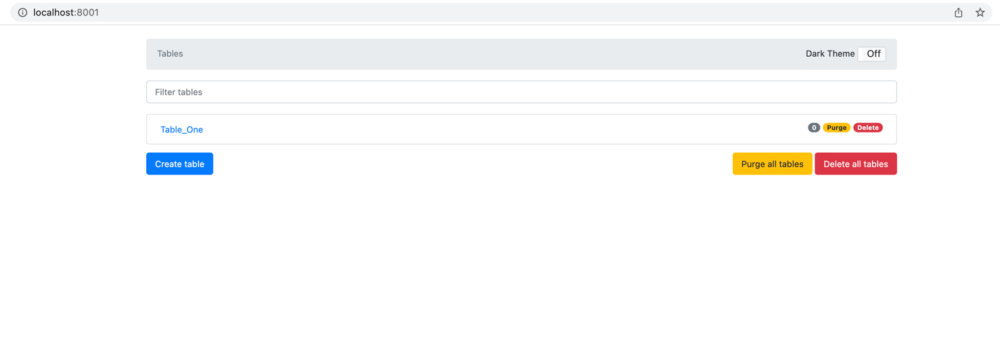

# dynamodb docker-compose utilities

This directory contains the docker compose utilities for dynamodb and dynamodb-admin.

## Single  Environment
NOTE: This configuration fits most development requirements, not recommended for production usage. 

Run with:
````
docker-compose -f dynamodb-dynamodb-admin-docker-compose.yml up ## To pull/start the docker image
docker-compose -f dynamodb-dynamodb-admin-docker-compose.yml down ## To stop and remove the docker image
````

### Access dynamodb-admin using below
- Dynamo DB adming URL : http://localhost:8081 (any free port cane be used, but define them in docker compose yml file)
- 


