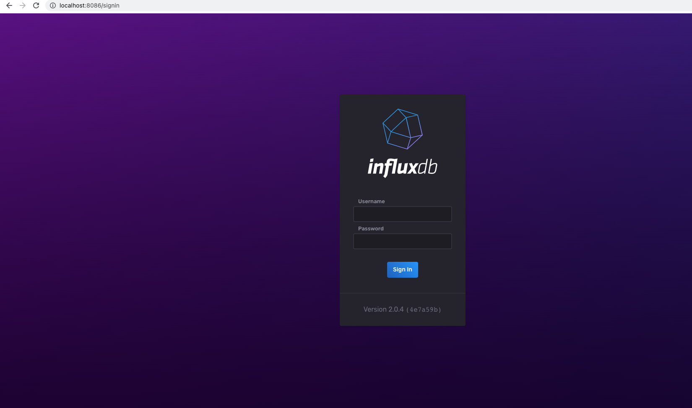
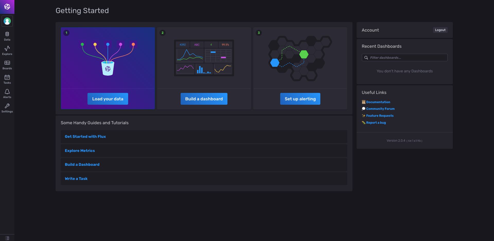

# Influx database docker-compose utilities

## InfluxDB:
Influx DB is an open source time series database written in Go language which is developed by InfluxData. It is optimized for high-availability retrieval of data,faster and storage of time series data in fields such as operations monitoring, application metrics, IoT sensor data, and real-time analytics.

InfluxDB is a high performance Time Series Database which can store data ranging from hundreds of thousands of points per second. The InfluxDB is a SQL-kind of query language which was built specifically for time series data
## What is Time Series?
A time series is a collection of observations of well-defined data items resulted through repeated measurements over time. Time series data is indexed in time order which is a sequence of data points.
- postgres tcp/ip connection available at $DOCKER_HOST_IP:5432
- postgres ui interface available at at $DOCKER_HOST_IP:8080

## How to Use this docker file ?
Simply run following commands to start and stop docker imageRun with:
````
docker-compose -f influx-db-docler-compose.yml up ## To pull/start the docker image
docker-compose -f influx-db-docler-compose.yml down ## To stop and remove the docker image
````

### Access InfluxDB using the TCP/IP
InfluxDB has support for wide variety of programming languages, below page describes the client libraries
https://docs.influxdata.com/influxdb/v1.8/tools/api_client_libraries/

### Access InfluxDB on web interface
- Access web url http://localhost:8086/ in browser. application looks like below.
  
- Provide below details as defined docker-compose yml file, you should be able to login.
    - Username: test_username
    - Password: test_password
- After you login, home page should look like below
  - 
- A test bucket is created for you to play around with influx db, you can add, delete bucket based on the need

## Note: This configuration NOT recommended for production usage, its only for development and get yourself familiarised with influx DB
